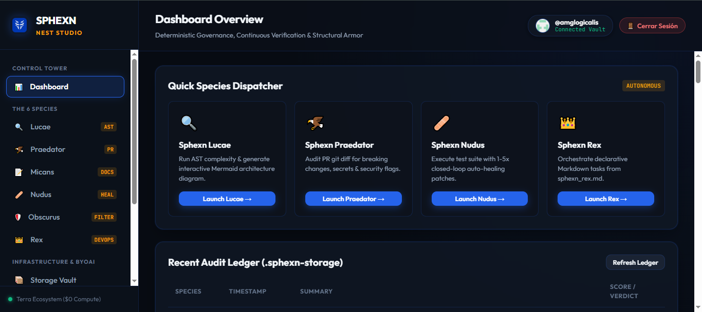

<p align="center">
  <a href="https://amglogicalis.github.io/sphexn-repo-public/" target="_blank">
    
  </a>
</p>

<h1 align="center">SPHEXN</h1>

<p align="center">
  <strong>Deterministic Governance Suite, Continuous Verification & Structural Armor</strong><br>
  <em>$0 Infrastructure Cost • Zero Runtime Dependencies • Ephemeral Execution • Closed-Loop Self-Healing • Multi-Provider BYOAI</em>
</p>

<p align="center">
  <a href="https://amglogicalis.github.io/sphexn-repo-public/" target="_blank">
    
  </a>
</p>

<p align="center">
  
  
  
  
  
  
  
  
</p>

---

## 🖥️ Consola Web Online: Sphexn Nest Studio

Accede directamente a la consola web interactiva alojada en GitHub Pages (sin instalación ni configuración de servidores):

👉 **[🌐 Abrir Sphexn Nest Studio en Vivo (24/7)](https://amglogicalis.github.io/sphexn-repo-public/)**

<p align="center">
  <a href="https://amglogicalis.github.io/sphexn-repo-public/" target="_blank">
    
  </a>
</p>

---

## 🐝 Visión y Filosofía

En el desarrollo de software moderno, la gobernanza del código, la auditoría de seguridad y la orquestación de CI/CD suelen requerir plataformas pesadas y costosas que introducen overhead y cuotas fijas.

**SPHEXN** nace para resolver esto mediante la optimización absoluta. Inspirado en la avispa *Sphex* —famosa en la ciencia cognitiva por su comportamiento de rutinas preprogramadas e inquebrantables—, Sphexn es una suite de gobernanza determinista de coste cero ($0 Compute).

Se ejecuta de forma efímera utilizando **únicamente las primitivas nativas de Node.js** (`node:vm`, `node:crypto`, `node:child_process`, `node:https`) y la infraestructura gratuita de **GitHub Actions** para auditar, reparar y orquestar el ciclo de vida del software con coste cero en reposo.

---

## 📦 Instalación y Puesta en Marcha

### 1. Instalación Global de la CLI
```bash
# Instalación global vía npm
npm install -g terra-sphexn

# Comprobar instalación
sphexn help
```

### 2. Ejecución Instantánea sin Instalación (`npx`)
```bash
# Ejecutar cualquier comando o especie al vuelo
npx terra-sphexn telemetry
npx terra-sphexn lucae --repo .
npx terra-sphexn console --port 7462
```

### 3. Instalación como SDK en Proyectos Node.js / TypeScript
```bash
npm install terra-sphexn
```

---

## 💻 Uso del SDK Programático

Sphexn expone una API limpia con tipado estricto en TypeScript para integrar gobernanza y auto-curación dentro de scripts o herramientas personalizadas:

```typescript
import { Sphexn } from 'terra-sphexn';

const sphexn = new Sphexn();

// 1. Análisis arquitectónico y complejidad ciclomática (Lucae)
const lucae = await sphexn.lucae({ repoPath: '.', maxLinesThreshold: 500 });
console.log(`Puntuación de Salud: ${lucae.healthScore}/100`);
console.log(lucae.markdownSummary);

// 2. Auditoría de Pull Request o git diff (Praedator)
const praedator = await sphexn.praedator({ diffRange: 'HEAD~1' });
console.log(`Veredicto del PR: ${praedator.verdict} (Score: ${praedator.score}/100)`);

// 3. Sincronización quirúrgica de documentación (Micans)
const micans = await sphexn.micans({ dryRun: true });
console.log(`Discrepancias detectadas: ${micans.discrepanciesCount}`);

// 4. Ejecución de tests con bucle cerrado de auto-curación (Nudus)
const nudus = await sphexn.nudus({ testCmd: 'npm test', maxRetries: 3 });
console.log(`Resultado final: ${nudus.finalSuccess ? 'PASÓ' : 'FALLÓ'}`);

// 5. Orquestación DevOps declarativa en Markdown & DAG (Rex)
const rex = await sphexn.rex({ planFile: 'sphexn_rex.md', selfHeal: true });
console.log(`Plan: ${rex.successCount}/${rex.totalTasks} tareas completadas exitosamente`);

// 6. Validación de código generado por LLM y detección de alucinaciones (Obscurus)
const obscurus = await sphexn.obscurus({ generatedCode: 'export const status = true;' });
console.log(`Confianza AST: ${obscurus.confidenceScore}/100 | Acción: ${obscurus.recommendedAction}`);

// 7. Telemetría de tokens y pools en tiempo real
const telemetry = sphexn.getTelemetry();
console.log(telemetry);
```

---

## ⚡ Guía Completa de Comandos CLI

### 1. Las 6 Especies Nucleares
```bash
# Lucae: Complejidad ciclomática, detección de God Files y síntesis Mermaid
sphexn lucae --repo . --threshold 500

# Praedator: Auditoría de PRs, fuga de secretos y breaking changes
sphexn praedator --diff-range HEAD~1

# Micans: Sincronización de README y APIs frente a cambios de código recientes
sphexn micans --dry-run

# Nudus: Ejecución de tests con auto-curación en bucle cerrado (1-5 reintentos)
sphexn nudus --test-cmd "npm test" --max-retries 3

# Rex: Orquestador DevOps declarativo en Markdown (sphexn_rex.md)
sphexn rex --plan sphexn_rex.md --self-heal

# Obscurus: Validación de código IA, verificación AST estricta y filtro de alucinaciones
sphexn obscurus --input output.json
```

### 2. Políticas Continuas y Disparadores (`sphexn auto`)
```bash
# Listar los 5 centinelas automatizados configurados
sphexn auto list

# Monitor continuo de tareas DevOps (Auto-Rex)
sphexn auto rex --watch --interval 30

# Centinela continuo para Pull Requests (Auto-Praedator)
sphexn auto praedator --watch

# Disparo manual de ciclo inmediato para cualquier especie
sphexn auto run rex
sphexn auto run praedator
```

### 3. Telemetría y Contabilidad de Tokens (`sphexn telemetry`)
```bash
# Visualizar tarjetas KPI en tiempo real y desglose por proveedor
sphexn telemetry

# Salida en formato JSON para consumo en pipelines o scripts
sphexn telemetry --json
```

### 4. Gestión de la Bóveda de Auditoría (`sphexn vault`)
```bash
# Listar auditorías históricas inmutables
sphexn vault list --species rex --limit 10

# Inspeccionar el informe detallado de una auditoría
sphexn vault inspect <auditId>

# Exportar historial a tabla Markdown o JSON
sphexn vault export --format md
sphexn vault export --format json --output historial.json

# Sincronizar con el repositorio remoto .sphexn-storage en GitHub
sphexn vault sync
```

### 5. Sondeo Inteligente y Pools de Claves BYOAI (`sphexn keys`)
```bash
# Listar inventario de claves activas y estado de salud
sphexn keys list

# Probar dinámicamente una clave con APIs oficiales en paralelo (Smart Prober)
sphexn keys probe "gsk_..."

# Sembrar automáticamente todas las claves desde mis_claves_reales.json
sphexn keys seed

# Añadir una clave con detección automática de proveedor
sphexn keys add "sk-..." --name "Mi Clave Producción"
```

### 6. Guía Interactiva en Terminal (`sphexn guide`)
```bash
# Ver el manual de arquitectura y buenas prácticas completo
sphexn guide

# Consultar la guía de obtención de claves gratuitas (sin URLs web externas)
sphexn guide --section 2

# Consultar la arquitectura de caché dedicada y 0% falsos positivos
sphexn guide --section 4
```

### 7. Lanzamiento de la Consola Web Local (`sphexn console`)
```bash
# Iniciar Sphexn Nest Studio localmente en el puerto predeterminado (7462)
sphexn console

# Iniciar en puerto personalizado
sphexn console --port 8080
```

---

## 🏛️ Las 6 Especies de Sphexn

| Especie | Rol | Mecánica Operativa | Nivel de Inferencia |
| :--- | :--- | :--- | :---: |
| 🔍 **Sphexn Lucae** | *Complejidad & Arquitectura* | Análisis AST nativo de complejidad ciclomática, God Files y síntesis de diagramas Mermaid. | **Zero-AI (100% Determinista)** |
| 🦅 **Sphexn Praedator** | *Auditor de Pull Requests* | Auditoría quirúrgica sobre git diffs: detecta breaking changes, filtraciones de secretos y fallos lógicos. | Phantom Intelligence |
| 📝 **Sphexn Micans** | *Sincronizador de Docs* | Detecta discrepancias código-documentación y aplica parches quirúrgicos de secciones sin truncar. | Phantom Intelligence |
| 🩹 **Sphexn Nudus** | *Auto-Curación & Tests* | Ejecuta pruebas, aísla stack traces y aplica fixes en bucle cerrado (1-5 intentos). Abre Issue si falla. | Phantom Intelligence |
| 👑 **Sphexn Rex** | *Orquestador DevOps* | Lee planes declarativos en Markdown (`sphexn_rex.md`), construye grafo DAG topológico y ejecuta tareas. | Phantom Intelligence |
| 🛡️ **Sphexn Obscurus** | *Filtro Anti-Alucinación* | Valida sintaxis estricta ESM/CJS, llamadas a APIs y dependencias de código LLM con caché dedicada SHA-256. | Determinista AST + AI |

---

## 🧠 Capa Phantom Intelligence (BYOAI Soberano)

Sphexn no almacena modelos pesados en servidores propios. En las especies que requieren inferencia, delega en la capa **Phantom Intelligence** con balanceo dinámico, rotación automática ante rate-limits y contabilidad de tokens:

* **Cohere**: Modelos `command-r-plus`, cuotas de trial gratuitas.
* **Groq**: Inferencia LPU ultra-rápida (`llama-3.3-70b-versatile`).
* **Mistral AI**: Modelos `mistral-large` para análisis exhaustivos.
* **Google Gemini**: Contextos de 1M-2M tokens (`gemini-2.5-flash`).
* **OpenRouter**: Agregador multimodelo con modelos de coste $0.
* **SambaNova & Cerebras Cloud**: Aceleración extrema para sanitización.
* **GitHub Models**: Acceso nativo mediante Personal Access Token (PAT).
* **Ollama**: Modelos locales en tu máquina para entornos 100% offline.

---

## 🛡️ Bóveda Inmutable & 0% Falsos Positivos

Para garantizar velocidad instantánea, ahorro de cuotas y cero falsos positivos:
- **Caché dedicada de runners para Obscurus y Rex**: Las ejecuciones idénticas calculan la firma criptográfica SHA-256 del contenido exacto de los archivos y del plan. Si no hay modificaciones, el resultado se recupera en **<10ms consumiendo 0 Tokens de LLM**.
- **Auditoría inmutable**: Todos los resultados se registran en el repositorio privado de GitHub `.sphexn-storage` o en fallback local `.sphexn_storage`.

---

## 📄 Licencia

Este proyecto está bajo la **Licencia MIT**. Consulta [LICENSE](LICENSE) para más detalles.

<p align="center">
  <sub>Parte del Ecosistema Terra • $0 Infraestructura • Cero Dependencias • Ejecución Efímera</sub>
</p>
